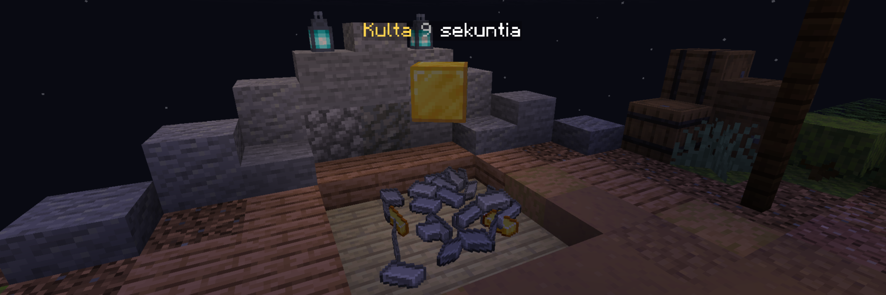
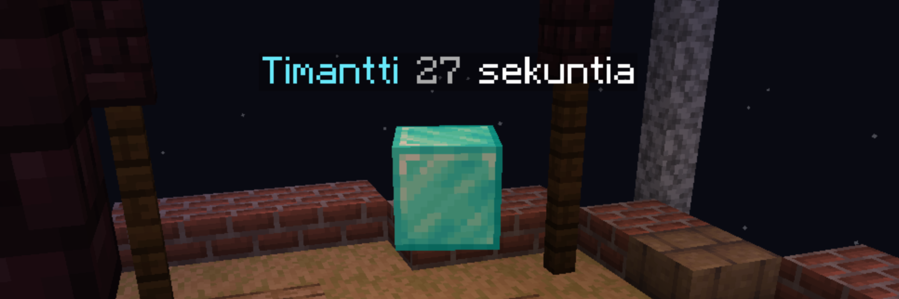
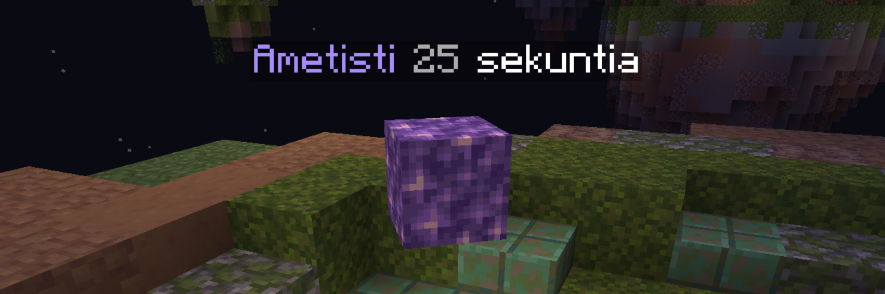
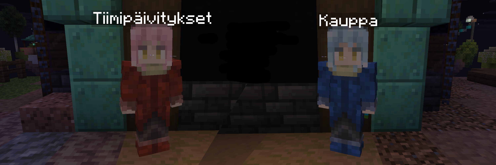

import { Tabs, TabItem } from '@astrojs/starlight/components';

Punkkasodassa tavoitteesi on suojella oman tiimisi punkkaa samalla tuhoten vihollistiimien punkat ja olla viimeinen tiimi hengissä.
Voit kuolla ja syntyä uudelleen niin kauan kun oma punkkasi on vielä tallella.
Kun punkkasi on tuhottu, et kuollessasi voi enää herätä henkiin.

## Generaattorit

Punkkasodassa on kolme erilaista generaattoria, jotka pudottavat materiaaleja tasaisin väliajoin.
Näillä materiaaleilla voit ostaa tavaroita ja tiimipäivityksiä joita tarvitset pelin voittamiseen.

<Tabs>
  <TabItem label="Rauta ja kulta">
    
    
    Rautaa ja kultaa saat omalta saarelta.
    Materiaaleista rauta on kaikista yleisin, jolla on mahdollista ostaa aloitustason palikoita, aseita ja muita yleishyödyllisiä tavaroita.

    Kultaa putoaa hitaammin kuin rautaa.
    Kullalla on mahdollista ostaa arvokkaampia tavaroita mitkä antavat huomattavan edun tiettyihin tilanteisiin.
    Tällaisia tavaroita ovat esimerkiksi **kultaiset omenat**, **päivitetyt aseet** ja **kestävämmät palikat**.

  </TabItem>
  <TabItem label="Timantti">
    
    
    Välisaaren generaattorit pudottavat timantteja joilla saat ostettua koko tiimillesi päivityksiä, kuten **terävämmät aseet** ja **suojausta (vähemmän kipua)**.
    Timantteja putoaa luonnollisesti harvemmin, kuin rautaa ja kultaa.
  </TabItem>
  <TabItem label="Ametisti">
    
    
    Keskisaaren generaattorit pudottavat ametisteja, joka on materiaaleista arvokkain.
    Ametisteilla voit ostaa pelin parhaimpia tavaroita, kuten **Rautapaita**, **taikajuomat** ja **podzol**.
  </TabItem>
</Tabs>

## Kauppa ja tiimipäivitykset

Omalla saarella olevalta kauppiaalta saa ostettua itselleen palikoita, aseita, suojausta ja paljon muita peliä helpottavia asioita.

Tiimipäivitykset ovat yhteisiä koko tiimiä hyödyntäviä parannuksia.
Päivityksiin kuuluu muun muassa terävemmät aseet, enemmän suojausta, nopeammat generaattorit.
