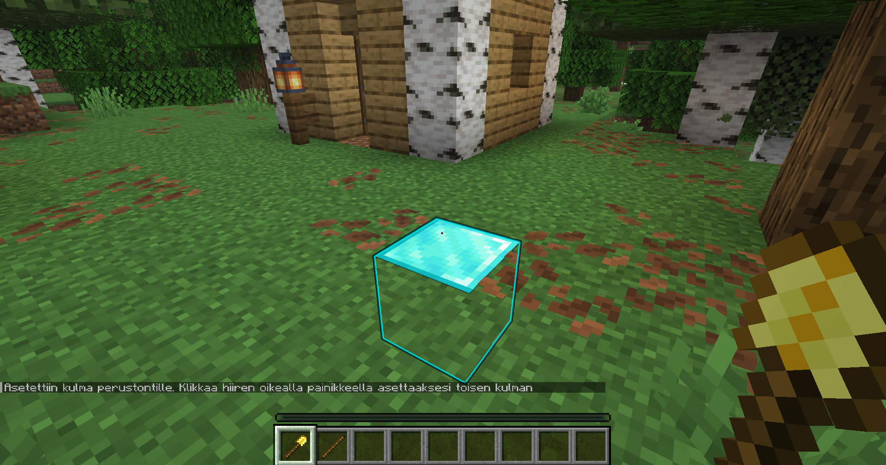
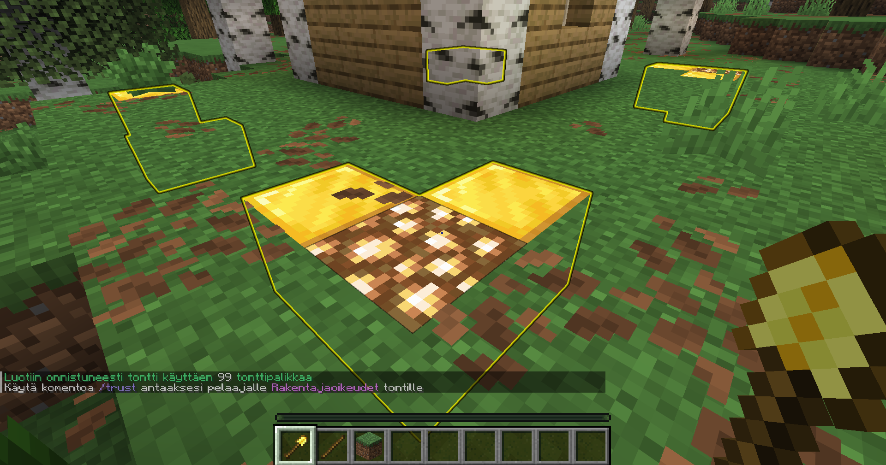
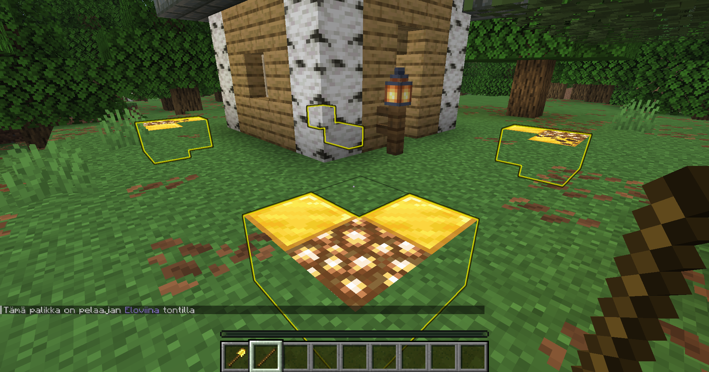
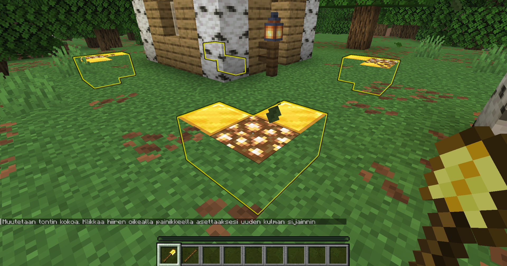
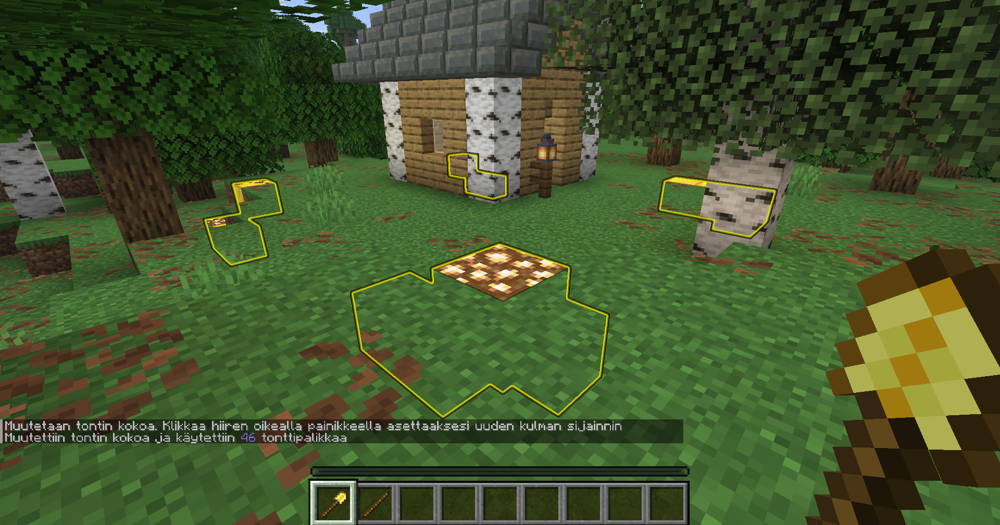
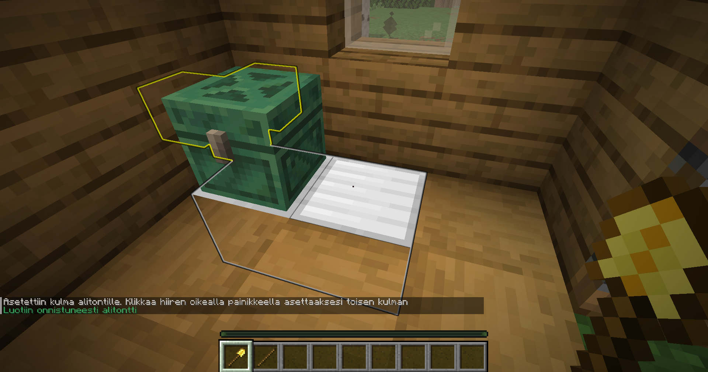
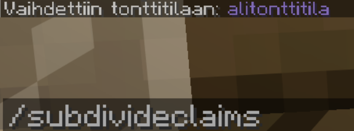
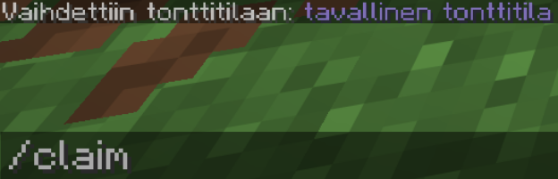

Omat rakennelmat kannattaa aina suojata, jotta muut pelaajat eivät pääse tuhoamaan niitä.
Suojaaminen onnistuu tonttien avulla.

Pelaajalla on alussa **100 tonttipalikkaa**.
Tonttipalikoita saa lisää pelaamalla FabiCraftin survivalissa (100 per tunti).

## Tontin luonti

Oman tontin luominen onnistuu oikeaklikkaamalla kultalapiolla suojattavan alueen kahta vastakkaista kulmaa.

Aloita klikkaamalla kultalapiolla ensimmäistä kulmaa, jonka jälkeen kulma muuttuu timanttipalikaksi.

Tämän jälkeen klikkaa vastakkaista kulmaa.
Tontin rajat ilmestyvät nyt näkyviin merkaten, että tontti on luotu.

## Tontin koon muokkaus

Tontin kokoa on mahdollista muuttaa myös jälkikäteen.
Tämä onnistuu myös kultalapiota käyttämällä.

Voit käyttää tikkua hahmottaaksesi missä tontti on.
Kun oikeaklikkaat tikulla kohti tonttia, näyttää se tontin rajat.
Voit myös mennä kyykkyyn klikatessasi, jolloin tikku näyttää kaikki lähellä olevat tontit.

Ota kultalapio käyteen ja klikkaa tontin kulmaa, jonka paikkaa haluat vaihtaa.
Chattiin tuleva viesti kertoo muokkaavasi tontin kokoa.

Seuraavaksi klikkaa palikkaa, johon haluat kulman siirtyvän. Valmis :)

:::note
Kulmaa siirrettäessä kultalapion täytyy olla koko ajan kädessä tai valinta nollaantuu.
:::

## Tonttien poisto

Voit poistaa tontin seisomalla sen sisällä ja kirjoittamalla komennon `/abandonclaim`.
Mikäli haluat poistaa kaikki tonttisi, voit tehdä sen kirjoittamalla `/abandonallclaims`.

## Oikeuksien jakaminen

Koska rakennuksesi on nyt suojattu muilta pelaajilta, vain sinä voit rakentaa siellä.
Muille pelaajille voi kuitenkin jakaa eritasoisia oikeuksia, jotka oikeuttavat heitä tekemään tiettyjä asioita tontillasi.

Alla listattuna kyseiset oikeudet:

| Oikeus | Kuvaus | Komento |
| --- | --- | --- |
| Hallinnointi | Antaa oikeuden hallita tontin asetuksia ja luoda alitontteja | `/permissiontrust <pelaaja>` |
| Rakentaja | Antaa oikeuden rakentaa tontilla | `/trust <pelaaja>` |
| Varastonhoitaja | Antaa oikeuden avata arkkuja ja muita tavaralaatikoita | `/containertrust <pelaaja>` |
| Pääsy | Antaa oikeuden käyttää ovia, nappuloita, vipuja yms. | `/accessortrust <pelaaja>` |

Saat poistettua pelaajalta oikeudet komennolla `/untrust <pelaaja>`.

## Alitontit

Tonttien sisälle on mahdollista luoda alitontteja, joiden avulla pelaajaoikeuksien säätäminen voidaan tehdä vielä tarkemmin.
Esim. Haluat luoda farmin, jota kaikki pelaajat voivat käyttää.

Alitonttien luonti toimii samalla tavalla kuin tavallisten tonttien luonti: kultalapion avulla.
Luotu alitontti tulee näkyviin tontin sisälle rautapalikoilla.

Alitontteja luodaksesi tulee sinun ottaa käyttöön alitonttitila komennolla `/subdivideclaims`.

Esim. Pelaajan tarvitsee päästä käsiksi vain muutamaan arkkuun tontin sisällä, mutta tontilla on myös muita arkkuja joihin he eivät saa koskea.
Voit tällöin luoda alitontin, jonka sisälle voit antaa oikeudet arkkujen avaamiseen (containertrust), jolloin muut tontin arkut jäävät silti suojatuksi.

Pääset takaisin tavalliseen tonttitilaan kirjoittamalla komennon `/claim`.

