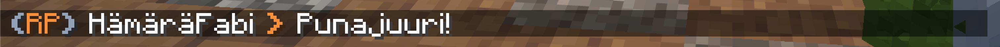

Voit ottaa roolipeliominaisuudet käyttöön komennolla `/rp`.
Poistaaksesi roolipeliominaisuudet käytöstä aja sama komento uudelleen!

## Roolipelichat
Roolipelichat näkyy **100 palikan säteellä** oleville pelaajille, jos he ovat ottaneet itselleen roolipelauksen käyttöön.
Kirjoitus chattiin onnistuu komennolla `/rpchat <viesti>`.

## Lempinimi
Lempinimi eli "nickname" on roolipelichatissa näkyvä nimi.

### Komennot
Komento | Kuvaus
--- | ---
`/nickname` | Näyttää nykyisen lempinimesi
`/nickname <nimi>` | Vaihtaa lempinimen
`/nickname reset` | Nollaa lempinimen
